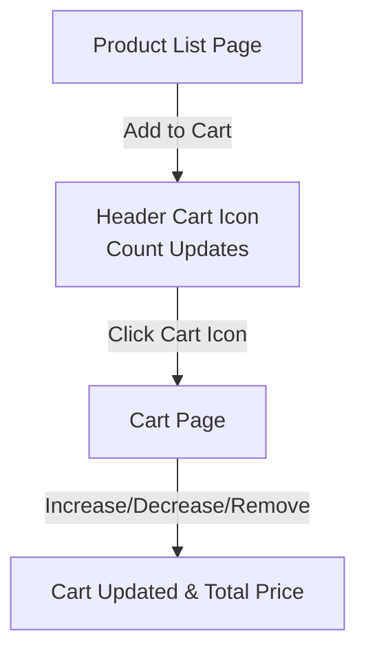

# Shopping Cart – React Frontend Assignment

A simple e-commerce frontend built with **React**, **TypeScript**, and **Tailwind CSS**.

This project demonstrates a basic shopping cart application with the following features:

- **Product List Page:** Browse a list of 20+ hardcoded products.
- **Add-to-Cart Functionality:** Add products to the cart, with support for quantity management.
- **Cart Page:** View, remove, or update the quantity of items added to the cart.
- **Paginated Product List:** (Bonus) Product listing supports pagination.
- **Sticky Header:** Header includes a cart icon with dynamic item count and navigation.

---

## Features

### 1. Layout
- Custom UI design with Tailwind CSS.
- Sticky header shows cart information and is always accessible.
- Two main pages:
  - **Product List Page** (`/home`)
  - **Cart Page** (`/cart`)

### 2. Product List Page
- Displays at least 20 hardcoded products.
- Each product shows:
  - **Name**
  - **Price**
  - **Image**
  - **"Add to Cart"** button

### 3. Cart Functionality
- Clicking "Add to Cart" adds the product (or increases quantity if already added).
- Cart displays:
  - Product name, quantity, and price
  - Controls to increase/decrease quantity
  - Remove button for each product
  - Total price of all items

### 4. Cart Count in Header
- Cart icon in the sticky header shows the total number of items currently in the cart.

---

## Architecture & State Management

- State is managed efficiently using React hooks (`useState`) and a custom `useContext` hook.
- Cart state persists through reloads and provides a smooth user experience.

---

## User Flow Diagram



---

## Tech Stack

- **React**
- **TypeScript**
- **Tailwind CSS**

---

## Getting Started

### Installation

```bash
cd shopping-cart
npm install
npm start
```

Visit [http://localhost:3000](http://localhost:3000) in your browser.

---

## Notes

- Built as a frontend-only demo; no backend or persistent storage except local state.
- Product data is hardcoded for demonstration.
- Pagination implemented as a bonus.
- All state management is handled with React hooks (`useState` and `useContext`).

---

## License

[MIT](LICENSE)

---

## Author

Asiya Tabasum Shaik(https://github.com/asiya-tabasum/)
